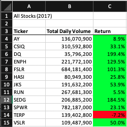
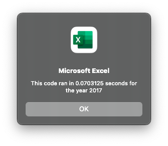
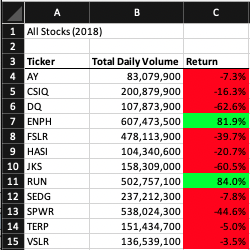
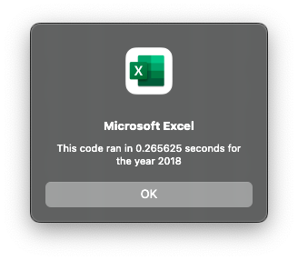
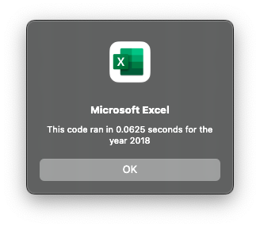

# VBA-Challenge
## Overview of Project
### Purpose
The intent of this project was to refactor (restructure (the source code of an application or piece of software) so as to improve operation without altering functionality) the original stock analysis code to see if I could obtain faster run times and allow for a larger diversification of data sets.

### Background
This macro was originally wrote for Steve so that he could analyze an entire dataset to do research for his parents. He really likes it, however, he wants to expand the dataset to include the entire stock market over the last few years. Refactoring the code allowed for larger data sets with less execution time for Steve.

## Analysis
The original code (as shown below) uses a Nested For Loop which runs each ticker independently by starting each of them at 0 and adding the total volume up as it goes through each row. This means one ticker is calculated, then the next, then the next, and so on. 
`
   '4) Loop through tickers
   For i = 0 To 11
       ticker = tickers(i)
       totalVolume = 0
       '5) loop through rows in the data
       Worksheets(yearValue).Activate
       For j = 2 To RowCount
           '5a) Get total volume for current ticker
           If Cells(j, 1).Value = ticker Then

               totalVolume = totalVolume + Cells(j, 8).Value

           End If
           '5b) get starting price for current ticker
           If Cells(j - 1, 1).Value <> ticker And Cells(j, 1).Value = ticker Then

               startingPrice = Cells(j, 6).Value

           End If

           '5c) get ending price for current ticker
           If Cells(j + 1, 1).Value <> ticker And Cells(j, 1).Value = ticker Then

               endingPrice = Cells(j, 6).Value

           End If
       Next j
       '6) Output data for current ticker
       Worksheets("All Stocks Analysis").Activate
       Cells(4 + i, 1).Value = ticker
       Cells(4 + i, 2).Value = totalVolume
       Cells(4 + i, 3).Value = endingPrice / startingPrice - 1

    Next i
`

The refactored code (as shown below) had several For Loops that run independent of one another starting with setting the initial volumes of each ticker to 0. Then looping all of the rows in the spreadsheet and increasing the volumes collectively within each array.

`
    'Loop for ticker volumes, set initial value to zero
    For i = 0 To 11
        tickerVolumes(i) = 0
    Next i
    
    '2b) Loop for all rows in spreadsheet
    For i = 2 To RowCount
    
        '3a) Increase volumes variable and add to current stock ticker
        If Cells(i, 1).Value = tickers(tickerIndex) Then
            tickerVolumes(tickerIndex) = tickerVolumes(tickerIndex) + Cells(i, 8).Value
        End If
        
        '3b) Check if current row is the first row selected in tickerIndex
        If Cells(i - 1, 1).Value <> tickers(tickerIndex) And Cells(i, 1).Value = tickers(tickerIndex) Then
            tickerStartingPrices(tickerIndex) = Cells(i, 6).Value
        End If
        
        '3c) Check if current row is the last row in the selected tickerIndex
        If Cells(i + 1, 1).Value <> tickers(tickerIndex) And Cells(i, 1).Value = tickers(tickerIndex) Then
            tickerEndingPrices(tickerIndex) = Cells(i, 6).Value
               
        '3d) Increase tickerIndex so next row matches previous row
        tickerIndex = tickerIndex + 1
            
        End If
        
    Next i
`

## Results
  

The first picture shown above is the data output after running the refactored macro, it was made to match the original macro. The second picture shows the original codes time output for year 2017. The third picture shows the refactored time output for year 2017. As one can see, the refactored code's time output for year 2017 was 0.1953125 seconds (73.52%) faster than the original code's time output for year 2017.

  

The first picture shown above is the data output after running the refactored macro, it was made to match the original macro. The second picture shows the original codes time output for year 2018. The third picture shows the refactored time output for year 2018. As one can see, the refactored code's time output for year 2018 was 0.203125 seconds (76.47%) faster than the original code's time output for year 2018. 

Since the refactored code's time outputs were both significantly faster than the original codes, it is inferred that the refactored code is more efficient than the original code. 

Since the refactored code includes arrays instead of hardcoding rows/columns like the original code does, it is inferred that the refactored code allows for more diversity among data sets. That is, the code is not limiting the data set. 

## Advantages and Disadvantages to Refactoring Code
### Advantages
One large advantage to refactoring code is it will make the code/program more efficient and allow for a larger diversification of data sets. If the original code was to continue being used, it would get slower and slower the larger the data sets become. By using the newer code, it will be able to handle much larger datasets more efficiently. 

### Disadvantages
A large disadvantage of refactoring code is that one could run into multiple bugs, or make the code more complicated than it needs to be. It may be harder to understand (because it is more complicated) although it may have less lines and better notes when completed.

## Teammates
Nick Foley helped me when I got stuck on portions of this project.
